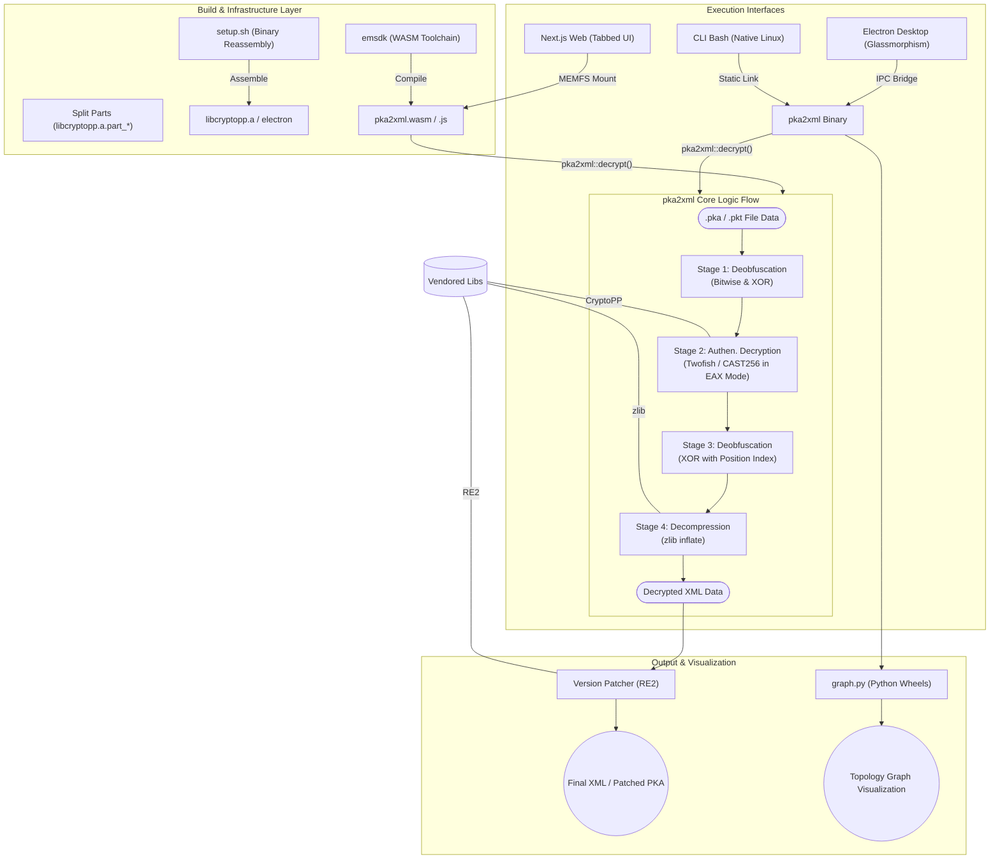

# pka2xml: Ultra-Vendored Reversing Kit
Copyright Rheehose (Rhee Creative) 2008 - 2026 All rights Reserved.

---

이 프로젝트는 Cisco Packet Tracer의 `.pka`, `.pkt` 파일을 리버싱하여 XML로 변환 및 암호화해주는 오프라인 자립형 패키지 툴킷입니다. 인터넷 환경이 없는 폐쇄망에서도 빌드 및 실행이 가능하도록 모든 의존성 패키징 기술(울트라 벤더링)이 적용되어 있습니다.

## ⚖️ License
본 프로젝트는 **GNU General Public License v3.0 (GPLv3)** 하에 배포됩니다. 

---

## 🌟 프로젝트 아키텍처 (Full Spectrum System Map)

### 📊 상세 시스템 데이터 흐름 및 구성도 (Detailed Architecture)
이 다이어그램은 초기 빌드 단계부터 내부 복호화 시퀀스, 그리고 멀티 플랫폼 배포까지 전 과정을 포함합니다.



---

### 📂 상세 디렉터리 기하 구조 (Detailed Directory Tree)
```text
pka2xml/
├── LICENSE             # GNU GPL v3 License
├── Makefile            # Native C++ 빌드 파이프라인
├── main.cpp            # core 진입점 (CLI Argument 파싱 및 엔진 호출)
├── setup.sh            # [Critical] 대용량 바이너리 조립 스크립트
├── run_cli.sh          # 고유 정적 라이브러리 기반 CLI 러너
├── run_gui.sh          # Electron GUI 러너
│
├── include/            
│   └── pka2xml.hpp     # 모든 복호화/암호화 로직이 캡슐화된 핵심 헤더
│
├── web/                # Next.js WASM 웹 플랫폼
│   ├── app/            # App Router (Home, Layout, CSS)
│   ├── components/     # WebCLI (xterm.js), WebGUI (Drag & Drop)
│   ├── lib/            # wasmLoader.ts (Emscripten Bridge)
│   └── build_wasm.sh   # [Automated] WASM 라이브러리 & 코어 빌드 스크립트
│
├── gui/                # Electron 데스크탑 플랫폼
│   ├── src/            # React Typescript 프론트엔드 (Premium UI)
│   ├── electron/       # Main/Preload IPC 통신 시스템
│   └── node_modules/   # 완전 벤더링된 의존성 (Zero-Install)
│
└── vendor/             # 100% 자립형 라이브러리 저장소
    ├── cryptopp/       # Twofish/CAST256 (Split-binary + Source)
    ├── re2/            # Google RE2 Regex Engine
    ├── libzip/         # libzip Source (WASM 빌드 지원)
    ├── zlib/           # 압축/해제 엔진
    ├── python_wheels/  # 시각화용 오프라인 Python Wheel 파일들
    └── emsdk/          # Emscripten WASM 툴체인 (Git-ignore 권장)
```

---

## 🚀 플랫폼별 실행 요강

### 1. Web (Next.js + WebAssembly)
- **무겁고 복잡한 설정 없이 브라우저에서 즉시 실행**
- Vercel 배포 최적화 헤더(`SharedArrayBuffer`) 지원

### 2. Desktop (Electron GUI)
- **오프라인 전문 시각화 툴로 활용**
- `./setup.sh` 실행 후 `./run_gui.sh`로 가동

### 3. CLI (Static Binary)
- **대량의 파일 자동화 처리 및 서버 백엔드용**
- `./run_cli.sh -d input.pka output.xml`

---

Copyright Rheehose (Rhee Creative) 2008 - 2026 All rights Reserved.
**하나님 중심의 가치와 대한민국 기술 자립의 승리를 선포합니다! 🦅🫡**
