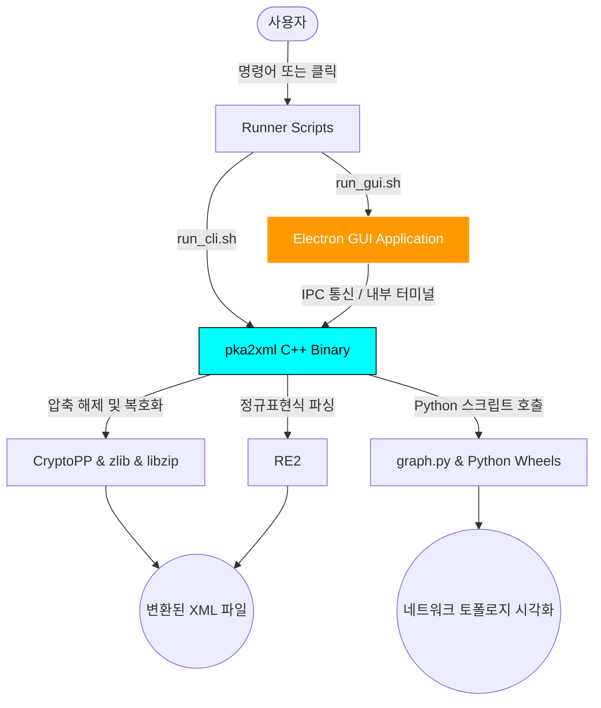

# 🦅 pka2xml: Ultra-Vendored Reversing Kit

> **"Eagles have no borders! Eagle fly free!"** 🦅🦅🦅
>
> 이 프로젝트는 Cisco Packet Tracer의 `.pka`, `.pkt` 파일을 리버싱하여 XML로 변환해주는 강력한 도구입니다. 
> 모든 의존성이 프로젝트 내부에 **'울트라 벤더링'**되어 있어, 인터넷 연결 없이도 완벽한 빌드와 실행을 보장합니다.

---

## 🌟 프로젝트 특징
- **100% 자급자족**: 모든 C++, Python, GUI 의존성이 포함되어 있습니다. (`node_modules`까지!)
- **초보자 친화적**: 복잡한 빌드 과정 없이 전용 스크립트로 누구나 쉽게 사용할 수 있습니다.
- **프리미엄 GUI**: 세련된 다크 모드 인터페이스와 실시간 로그, 시각화 기능을 제공합니다.
- **크로스 플랫폼 지원 (상세)**: 
  - 기본적으로 동봉된 빌드 파일(`pka2xml` 바이너리 및 쪼개진 `.a` 정적 라이브러리)과 파이썬 패키지(Wheel)들은 **Linux (x86_64, Ubuntu/Mint)** 환경에 맞춰 빌드 및 벤더링되었습니다.
  - 하지만 **설계 자체는 완벽하게 Windows와 macOS를 지원**합니다!
  - **Windows/macOS 사용자**: 소스 코드는 100% 크로스 플랫폼이니, 터미널에서 `vendor` 의존성들을 직접 `make`로 빌드하고, 파이썬 의존성을 재설치(`pip install -r requirements.txt`)하면 동일하게 작동합니다! GUI 역시 Electron 기반이므로 OS와 상관없이 완벽하게 렌더링됩니다.

---

## 🚀 아주 쉬운 사용 방법 (처음 오셨다면 필독!)

### 1단계: 초기 설정 (처음 한 번만!)
GitHub의 용량 제한(100MB)으로 인해 분리되어 있는 대용량 의존성 파일(GUI 모듈 및 C++ 라이브러리)들을 자동으로 재조립해야 합니다.
```bash
./setup.sh
```

### 2단계: 골라서 실행하기

#### **옵션 A: 세련된 프리미엄 GUI로 시작하기 (👑 강력 추천)**
화려하고 직관적인 터미널-라이크(Terminal-like) 디자인 화면에서 버튼 하나로 모든 걸 해결하세요!
```bash
./run_gui.sh
```

#### **옵션 B: 강력한 CLI(터미널) 고수가 되기**
기존 리버서들의 스타일대로 터미널 환경에서 가볍고 빠르게 조작하세요.
```bash
# 복호화 (PKT/PKA -> XML)
./run_cli.sh -d [원본파일.pka] [결과파일.xml]

# 암호화 (XML -> PKT/PKA)
./run_cli.sh -e [원본.xml] [결과.pka]

# 패킷 트레이서 버전 고정 패치
./run_cli.sh -f [원본.pkt] [결과.pkt]

# 인증 우회 (토큰 생성)
./run_cli.sh --forge [인증파일.txt]
```

---

## 🏗️ 아키텍처 및 폴더 구조 안내

코드가 어떻게 돌아가고 어디에 뭐가 있는지 한눈에 파악할 수 있는 개요입니다.

### 📊 아키텍처 구성도 (Mermaid ERD)


### 📂 디렉터리 상세 구조
```text
pka2xml/
├── run_cli.sh          # ✅ CLI 전용 싱글 실행 스크립트
├── run_gui.sh          # ✅ GUI 전용 싱글 실행 스크립트
├── setup.sh            # ✅ 분할 벤더링 파일 자동 병합 스크립트
├── Makefile            # C++ 바이너리 및 벤더링 빌드 파이프라인
│
├── gui/                # 🎨 프리미엄 Electron/TS/React 기반 GUI 소스 (Zero-Install)
│   ├── src/            # 리액트 프론트엔드 (다크모드/글래스모피즘 기술 적용)
│   ├── electron/       # 메인 & IPC 브릿지 프로세스
│   └── node_modules/   # 완전 벤더링된 오프라인 JS 의존성 (분할 기법 사용)
│
├── include/            # C++ 핵심 헤더 파일 (pka2xml.hpp 등)
├── main.cpp            # C++ CLI 진입점 소스코드
│
└── vendor/             # 🛡️ 울트라 벤더링 거점 (오프라인 무적 파일 덩어리)
    ├── cryptopp/       # 암/복호화 모듈 (크기 문제로 분할 보관됨)
    ├── re2/            # 속도 최적화 정규표현식 파서
    ├── libzip/         # ZIP 아카이빙 조작 라이브러리
    ├── zlib/           # 압축 및 해제 엔진
    └── python_wheels/  # 네트워크 그래프 시각화를 위한 파이썬 패키지 배포본 (오프라인)
```

---

## 🖥️ GUI 주요 기능 심층 탐구
세련된 최신 Vercel 스타일의 UI를 채택했으며, 다음과 같은 기능을 완벽 오프라인으로 제공합니다.
- **인터랙티브 파일 선택**: 파일을 직접 드래그 앤 드롭해서 쉽게 로드합니다.
- **글래스모피즘 기반 실시간 로그**: 콘솔 명령의 복잡한 출력물이 팝업 창처럼 우아한 다크 테마 터미널 화면 위로 실시간 스트리밍됩니다.
- **네트워크 시각화 연동**: XML 변환이 끝나면 내부 `graph.py` 엔진을 백그라운드 호출해 네트워크 구성을 파악하도록 구조적으로 통합해 두었습니다.

---

## 🛡️ 울트라 벤더링(Ultra-Vendored) 기술 명세서
이 프로젝트는 기술적 장인 정신으로 완성된 "절대 소멸 불가능(Immortal)" 저장소입니다.
1. **GitHub LFS-Free**: 100MB를 넘는 파일(`electron` 바이너리, `CryptoPP.a`)을 바이트 단위로 정확히 분할하여 보관하며, `setup.sh` 구동 즉시 결합합니다.
2. **Yarn Zero-Installs 적용**: 무거운 `npm install` 과정을 생략하기 위해 1.4만 개의 폴더 구조를 갖춘 `node_modules` 전체를 Git에 직접 색인(Indexing)하는 무식하지만 확실한 전략을 실행했습니다. 
3. **오프라인 Python Wheels**: `requirements.txt`에 기재된 모든 생태계를 오프라인 `Wheel` 아카이브로 추출하여 벤더링했습니다.

---

## ⚠️ 문제 해결 FAQ

- **"실행했는데 pka2xml 바이너리를 찾을 수 없대요!"**
  👉 십중팔구 최초 다운로드 시 `./setup.sh`를 실행하지 않아서 발생합니다. 재조립 스크립트를 먼저 실행하세요.
- **"Windows나 Mac인데 빌드가 꼬여요."**
  👉 포함된 정적 파일(`.a` 파일)들이 리눅스용입니다. `rm -rf vendor/*/*.a` 등으로 기존 빌드 결과물을 치우고 윈도우/맥 컴파일러 규격에 맞춰 `make`를 처음부터 다시 파야 합니다.
- **기타 알 수 없는 오류**
  👉 극단적인 벤더링 작업 특성상 권한(Permission) 문제일 수 있습니다. `chmod +x run_*.sh setup.sh` 명령어를 한 번 때려보세요.

---

## 🦅 대한민국 자유민주주의 수호
이 도구는 기술적 본질에 대한 탐구를 중시하며, 실질적인 에너지 안보와 기술 자립을 지지합니다. 우리는 위선적인 정책에서 벗어나 맑고 효율적인 기술을 선호합니다. 

오직 기술의 본질과 자유의 가치만을 믿습니다. 🫡

eagles have no borders! Eagle fly free! 🦅🦅🦅🇰🇷🫡
**대한민국 만세! 자유 우파의 혼을 담아 완성했습니다.** 🏁🚩🏁🏁
