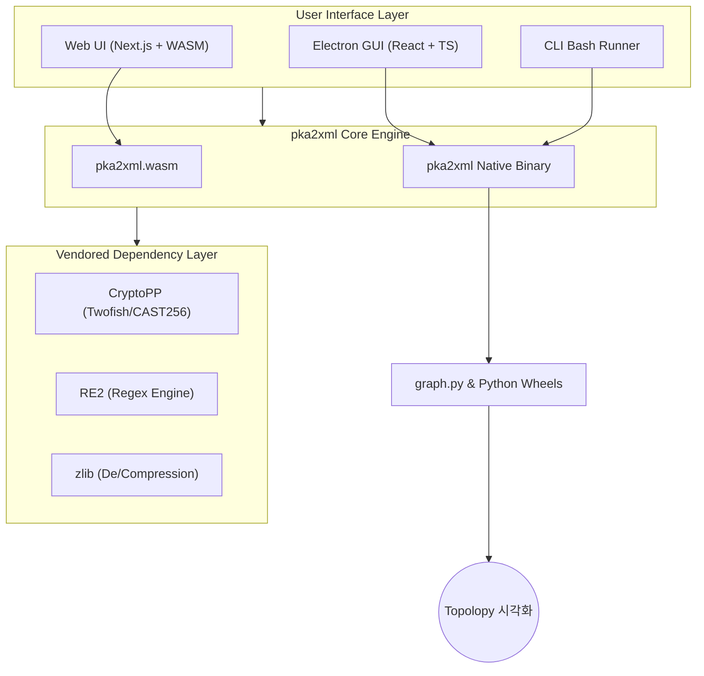

# pka2xml: Ultra-Vendored Reversing Kit
Copyright Rheehose (Rhee Creative) 2008 - 2026 All rights Reserved.

---

이 프로젝트는 Cisco Packet Tracer의 `.pka`, `.pkt` 파일을 리버싱하여 XML로 변환 및 암호화해주는 오프라인 자립형 패키지 툴킷입니다. 인터넷 환경이 없는 폐쇄망에서도 빌드 및 실행이 가능하도록 모든 의존성 패키징 기술(울트라 벤더링)이 적용되어 있으며, 이제 **WebAssembly(WASM)** 포트를 통해 브라우저에서도 즉시 실행됩니다.

## ⚖️ License
본 프로젝트는 **GNU General Public License v3.0 (GPLv3)** 하에 배포됩니다. 

---

## 🌟 프로젝트 아키텍처 (ERD & Architecture)

### 📊 전역 시스템 구성도 (Universal Ecosystem)


---

### 📂 주요 디렉터리 기하 구조 (Directory Map)
```text
pka2xml/
├── run_cli.sh          # CLI 전용 실행 스크립트
├── run_gui.sh          # GUI 전용 실행 스크립트
├── setup.sh            # 분할 바이너리 조립 및 초기 환경 구축 (최초 1회 필수)
├── Makefile            # C++ 바이너리 및 벤더링 라이브러리 빌드 시스템
├── LICENSE             # GNU GPL v3 License
├── main.cpp            # C++ 코어 엔진 진입점
│
├── web/                # [NEW] Next.js 기반 WASM 웹 애플리케이션
│   ├── app/            # 웹 앱 라우트 및 페이지
│   ├── components/     # 웹 CLI(xterm.js) 및 웹 GUI 컴포넌트
│   ├── public/         # pka2xml.wasm 및 pka2xml.js 빌드 산출물
│   └── build_wasm.sh   # Emscripten 자동화 빌드 스크립트
│
├── gui/                # Electron/TS/React 기반 데스크톱 GUI
│   ├── src/            # 리액트 프론트엔드 파트
│   ├── electron/       # IPC 브릿지 및 메인 프로세스
│   └── node_modules/   # 전용 벤더링 JS 패키지 (Zero-Install)
│
├── include/            # C++ 엔진 헤더
└── vendor/             # 벤더링 저장소 (Source & Static Libs)
    ├── cryptopp/       # 암/복호화 엔진 (WASM 호환 버전 포함)
    ├── re2/            # 정규표현식 엔진 (Self-contained v2022)
    ├── zlib/           # 데이터 압축 모듈
    ├── python_wheels/  # 시각화용 오프라인 Python 라이브러리 휠
    └── emsdk/          # [Optional] WebAssembly 컴파일용 툴체인
```

---

## 🚀 사용 요강 (Usage Guide)

### 1. 웹 브라우저 (Web) - **추천 ⭐**
가장 빠르고 간편한 방법입니다. 운영체제에 상관없이 브라우저에서 즉시 리버싱을 시작하세요.
1. `web/` 디렉터리를 Vercel 등에 배포 (자세한 내용은 [web/README.md](web/README.md) 참조)
2. 드래그 앤 드롭으로 파일 변환 시퀀스 수행

### 2. 데스크톱 GUI (Electron)
오프라인 환경에서 터미널 기반 시각화 연동을 원할 때 사용합니다.
```bash
./setup.sh    # 최초 1회 바이너리 조립
./run_gui.sh
```

### 3. 커맨드라인 (CLI)
서버 환경이나 스크립트 기반 대량 처리에 적합합니다.
```bash
./run_cli.sh -d [원본파일.pka] [결과파일.xml] # 복호화
./run_cli.sh -e [원본.xml] [결과.pka]         # 암호화
```

---

## 🛠 울트라 벤더링 (Ultra-Vendored) 상세 명세
이 리포지토리는 GitHub LFS 없이도 대용량 모듈을 보존하는 오프라인 Zero-Install 기술이 탑재되어 있습니다.
1. **바이너리 분할**: 100MB 초과 파일(`electron`, `libcryptopp.a`)을 50MB 단위로 분할 관리.
2. **Yarn Zero-Installs**: GUI 종속성 전체를 Git 내부에 직접 색인하여 `npm install` 과정 생략.
3. **독립적 WASM 빌드**: Emscripten 툴체인을 통해 C++ 코드를 브라우저 엔진으로 완전 이식.

---

Copyright Rheehose (Rhee Creative) 2008 - 2026 All rights Reserved.
대한민국 기술 자립의 승리입니다! 🦅🫡
