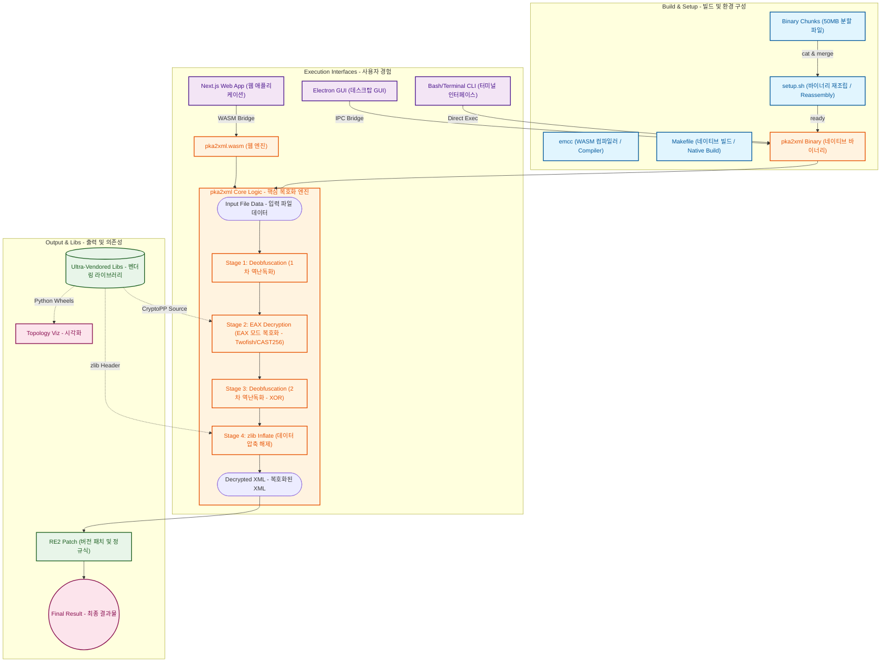

# pka2xml: Ultra-Vendored Reversing Kit
Copyright Rheehose (Rhee Creative) 2008 - 2026 All rights Reserved.

---

이 프로젝트는 Cisco Packet Tracer의 `.pka`, `.pkt` 파일을 리버싱하여 XML로 변환 및 암호화해주는 오프라인 자립형 패키지 툴킷입니다. 인터넷 환경이 없는 폐쇄망에서도 빌드 및 실행이 가능하도록 모든 의존성 패키징 기술(울트라 벤더링)이 적용되어 있습니다.

## ⚖️ License (라이선스)
본 프로젝트는 **GNU General Public License v3.0 (GPLv3)** 하에 배포됩니다. 

---

## 🌟 전역 시스템 아키텍처 (Universal System Architecture - ERD)

### 📊 초정밀 데이터 흐름 및 기술 구성도 (Hyper-Detailed Data Flow)
이 다이어그램은 빌드 시스템, 내부 복호화 엔진, 사용자 인터페이스, 그리고 후처리의 전 과정을 **한영병기(KR/EN)** 및 **컬러 코딩**으로 상세히 나타냅니다.



---

### 📂 상세 디렉터리 기하 구조 (Comprehensive Directory Tree)
```text
pka2xml/ (루트 디렉터리)
├── LICENSE             # GNU GPL v3 License (GPLv3 라이선스)
├── Makefile            # C++ Native Build System (네이티브 빌드 시스템)
├── main.cpp            # Entry Point (메인 진입점 소스)
├── setup.sh            # Binary Reassembly Script (분할 바이너리 조립 스크립트)
├── run_cli.sh          # CLI Runner Script (CLI 실행 스크립트)
├── run_gui.sh          # Desktop GUI Runner (데스크탑 GUI 실행 스크립트)
│
├── include/            # C++ Engine Headers (C++ 엔진 헤더 폴더)
│   └── pka2xml.hpp     # Core Decryption Logic (핵심 복호화 로직 헤더)
│
├── web/                # WebAssembly Platform (WASM 웹 플랫폼)
│   ├── app/            # Framework Routes (Next.js 라우트)
│   ├── components/     # UI Components (WebCLI, WebGUI 컴포넌트)
│   ├── lib/            # WASM Loaders (WASM 로딩 브릿지)
│   └── public/         # WASM Binaries (WASM/JS 산출물)
│
├── gui/                # Desktop Platform (데스크탑 플랫폼)
│   ├── src/            # Frontend Source (GUI 프론트엔드 소스)
│   ├── electron/       # Main Process (일렉트론 메인 프로세스)
│   └── node_modules/   # Vendored JS Deps (완전 벤더링 JS 패키지)
│
└── vendor/             # Self-contained Dependencies (자립형 의존성)
    ├── cryptopp/       # CryptoPP Source & Libs (암호화 라이브러리 소스)
    ├── re2/            # Google RE2 Engine (RE2 정규식 엔진)
    ├── zlib/           # Compression Engine (압축 엔진)
    ├── python_wheels/  # Offline Python Packages (오프라인 파이썬 패키지)
    └── emsdk/          # Emscripten SDK (WASM 컴파일 툴체인)
```

---

## 🚀 플랫폼별 실행 요강 (Execution Guide)

### 1. Web (Next.js + WebAssembly) - 웹 플랫폼
- **No-Install**: 브라우저에서 즉시 실행 (WASM 기반)
- [Vercel Deployment Guide](web/README.md) 참조

### 2. Desktop (Electron GUI) - 데스크탑 플랫폼
- **Topology Analysis**: 오프라인 전문 분석 UI
- `./setup.sh` 실행 후 `./run_gui.sh`로 가동

### 3. CLI (Static Binary) - 커맨드라인
- **Hardcore Reversing**: 스크립트 자동화 및 대량 변환용
- `./run_cli.sh -d input.pka output.xml`

---

Copyright Rheehose (Rhee Creative) 2008 - 2026 All rights Reserved.
**하나님 중심의 가치와 대한민국 기술 자립의 승리를 선포합니다! 🦅🫡**
